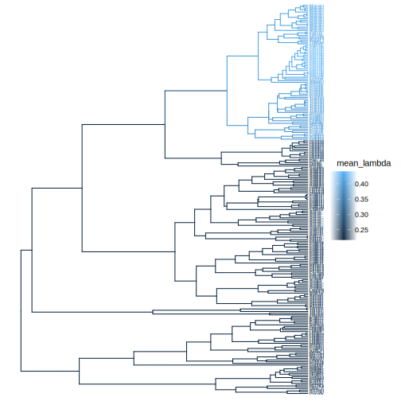

## Pesto.jl: Phylogenetic Estimation of Shifts in the Tempo of Origination

[](https://kopperud.github.io/Pesto.jl/stable)
[](https://kopperud.github.io/Pesto.jl/dev)

The program can fit state-dependent speciation and extinction (SSE, Maddison et al 2007) models on reconstructed phylogenetic trees. We use these models to make inferences about when, and on which branches, there were shifts in the tempo of the process of diversification. The method is equivalent to the one presented by Höhna et al (2019), however it is much faster. The runtime of Pesto scales linearly with the number of tips in the phylogeny, and can be run on huge phylogenies (> 30k taxa) without much trouble on a standard laptop computer.

## Installation

```julia
import Pkg
Pkg.add("Pesto")
```

## Example rate analysis

```julia
using Pesto

phy = readtree(Pesto.path("primates.tre"))
ρ = 0.635 ## taxon sampling fraction
primates = SSEdata(phy, ρ)
model, rates = pesto(primates)
```

The output if plotted using the `ggtree` R-package will look something like the following figure. In the primates phylogeny, it is clear that there was one large shift in speciation rate in the branch that led to the Old World Monkeys clade.



See the website at [https://kopperud.github.io/Pesto.jl/dev](https://kopperud.github.io/Pesto.jl/dev) for the documentation, and for an explanation of how the model is set up.

## References

* Maddison, W. P., Midford, P. E., & Otto, S. P. (2007). Estimating a binary character's effect on speciation and extinction. Systematic biology, 56(5), 701-710.
* Höhna, S., Freyman, W. A., Nolen, Z., Huelsenbeck, J. P., May, M. R., & Moore, B. R. (2019). A Bayesian approach for estimating branch-specific speciation and extinction rates. BioRxiv, 555805.

