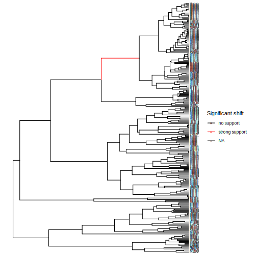

# [Significant shifts](@id bayesfactor)

In this vignette we will assess the support for that a branch has at least one rate shift, versus the null hypothesis of no shifts. We will test this using Bayes factors, i.e. the relative support for one or more versus no shifts.

### Tree file

First, we load the necessary modules and read in the tree file.

```@setup bayes
using Pesto
using Plots

ρ = 0.635

include("../../src/primates.jl")
```
```julia bayes
using Pesto

phy = readtree(Pesto.path("primates.tre"))
ρ = 0.635
primates = SSEdata(phy, ρ)
```

### Model setup

Let's use the standard `Pesto` analysis with empirical Bayes for the speciation and extinction rates, and maximum-likelihood shift rate.

```@example bayes
model, rates = pesto(primates; n = 6)
nothing # hide
```

## Bayes factors

A Bayes factor is a summary of the evidence in favor of one hypothesis, as opposed to a different hypothesis (Kass & Raftery 1995). In `Pesto`, we use Bayes factors to assess the evidence for the hypothesis that there was at least one diversification rate shift, versus the hypothesis that there were no rate shifts, per branch. The standard equation for a Bayes factor is as follows (see also Shi & Rabosky 2015)

```math
    \text{Bayes factor} = \frac{\frac{P_M(\geq \text{1 shifts})}{\pi_M(\geq \text{1 shifts})}}{\frac{P_M(0 \text{ shifts})}{\pi_M(0 \text{ shifts})}}
```
where $P_M(\geq \text{1 shifts})$ is the posterior probability of at least one shift, $P_M(\geq \text{0 shifts})$ is the posterior probability of no shifts, $\pi_M(\geq \text{1 shifts})$ is the prior probability of at least one shift, and $\pi_M(\geq \text{0 shifts})$ is the prior probability of no shifts.

## Plotting Bayes factors

We can for example plot the Bayes factor directly on the tree. Since the Bayes factor can vary considerably, we instead plot the log-transformed Bayes factors, which are more concentrated around 0. A log Bayes factor with a value of 0 means that the prior and posterior support for the shift hypotheses are equal. A value much larger than 0 means that there is support for one or more shifts. A value of less than 0 means that there is more support for 0 rate shifts.

```@example bayes
using Makie, CairoMakie

min, max = extrema(rates[1:end-1,"shift_bf_log"])
values = [min, 0, max]
cmap = Makie.cgrad([:gray, :black, :purple], values = values)
treeplot(primates, rates, "shift_bf_log"; cmap = cmap)
```

```julia
R"""
library(ggplot2)
library(ggtree)
p1 <- ggtree(td, aes(color = log(shift_bf))) +
    scale_color_gradient2(low = "white", mid = "black", high = "red", midpoint = 0) +
    geom_tiplab(size=2) +
    labs(color = "log Bayes factor")
"""
```


## Plotting supported branches

Alternatively, we can assess which branches had a strong support for there being at least one shift. We first set the significance level at 10, meaning strong support (Kass & Raftery 1995). Next, we can compute which branches has strong support for at least one diversification rate shift, vs the null hypothesis of zero shifts. 

| Bayes factor   | log10 Bayes factor | Level of support     |
| -------------- | ------------------ | -------------------- |
| 0 to 3.2       | 0 to 0.5           | Not worth mentioning |
| 3.2 to 10      | 0.5 to 1           | Substantial          |   
| 10 to 100      | 1 to 2             | Strong               |
| >100           | >2                 | Decisive             |

```julia
R"""
significance_level <- 10

td@data$signif_shifts <- factor(td@data$shift_bf > significance_level)
p2 <- ggtree(td, aes(color = signif_shifts)) +
    scale_color_manual(values = c("black", "red"), labels = c("no support", "strong support")) +
    geom_tiplab(size=2) +
    labs(color = "Significant shift")
"""
```


If we inspect the data frame with the branch-specific outputs, we can also see this branch specifically. Both the phylogeny plot, as well as the filtered data frame, only show one branch that had strong support (with a Bayes factor of >10) for one or more shifts. The number of estimated diversification rate shifts ($\hat{N}$) on this branch is also significantly larger than one, almost at 1 number of shifts.

```@example bayes
using DataFrames
filter(:shift_bf => x -> x > 10, rates)
```

### References

* Kass, R. E., & Raftery, A. E. (1995). Bayes factors. Journal of the american statistical association, 90(430), 773-795.
* Shi, J. J., & Rabosky, D. L. (2015). Speciation dynamics during the global radiation of extant bats. Evolution, 69(6), 1528-1545.


