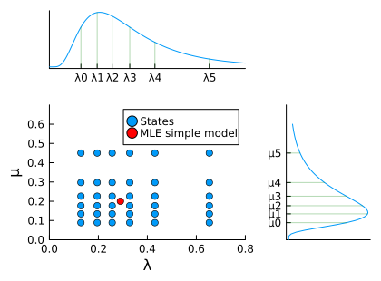

# Extended rate analysis

In this vignette, we will do the same as in the simple analysis, but we explain how the model is set up in more detail.

We use a State-dependent Speciation Extinction (SSE) model, with a K-sized state space, in order to get at the question of rate heterogeneity across branches. The Binary SSE model (BiSSE) was first introduced to study rate variation in association with trait data, i.e. each species was assigned a state at the tips of the tree. In our approach, however, we don't use trait data, and consider the tip states unknown, and equally probable for all states at the tips. 

## Tree file

First, we load the necessary modules and read in the tree file.

```@setup extended
using Pesto

ρ = 0.635

include("../../src/primates.jl")
```
```julia extended
using Pesto

phy = readtree(Pesto.path("primates.tre"))
ρ = 0.635
primates = SSEdata(phy, ρ)
```

## Model choice

Next, we set up the SSE model, including its dimensionality and hyperparameters. For this model, we will draw the speciation rate (λ) and extinction rate (µ) from LogNormal distributions. We pick the median of the LogNormal distributions such that they correspond to the maximum-likelihood estimates of the constant-rate birth-death model. We pick the log-sd as `H = 0.587`, which corresponds to a LogNormal distribution whose 2.5%-97.5% quantile spans one order of magnitude. 


```@example extended
λml, μml = estimate_constant_bdp(primates)

H = 0.587
n = 6

using Distributions
dλ = LogNormal(log(λml), H)
dμ = LogNormal(log(µml), H)

λquantiles = make_quantiles(dλ, n)
µquantiles = make_quantiles(dμ, n)
λ, μ = allpairwise(λquantiles, µquantiles)
nothing # hide
```
The scatter plot of `λ` on the x-axis, and `µ` on the y-axis looks like the figure below (blue dots), with the quantiles of the LogNormal distributions on the margin.



Next, we estimate the rate shift parameter η under the SSE model, conditional on λ and µ.
```@example extended
η = optimize_eta(λ, µ, primates)
```

The units of $\eta$ are number of rate shift events per lineage per time. The product of the tree length times $\eta$ will give us the number of expected rate changes under the prior:
```@example extended
sum(primates.branch_lengths) * η
```

This allows us to set up the SSE model object:
```@example extended
model = SSEconstant(λ, μ, η)
nothing # hide
```

With the model and data objects we can for example calculate the log likelihood
```@example extended
logL_root(model, primates)
```

## Branch rates and shifts
Or we can compute both the postorder and preorder pass, and get the expected speciation and extinction rates per branch. The result is a data frame object, and we print the first five rows:
```@example extended
rates = birth_death_shift(model, primates)
rates[1:5,:]
```

## Tree plots
If we want to plot the results, we can use the module `RCall`. Julia objects can be exported to an R session using the macro `@rput`, (and retrieved from R with `@rget`). R code can be called by prefixing a string with `R`, e.g. `R"print()"`, or multiline `R"""..."""`. You can also enter the R session interactively through the Julia REPL by entering the character `$`. Here we plot the phylogeny using some R-packages that we load first.

```julia
using RCall

@rput primates
@rput rates

R"""
library(tibble)
library(tidytree)
x <- as_tibble(primates)
td <- as.treedata(merge(x, rates, by = "node"))
"""
```

We can plot the mean speciation rate

```julia
R"""
library(ggtree)
p1 <- ggtree(td, aes(color = mean_lambda)) +  
    geom_tiplab(size=2)
"""
```


We can also plot the number of accumulated shifts on the branches
```julia
R"""
library(ggplot2)
p2 <- ggtree(td, aes(color = nshift)) + 
    geom_tiplab(size=2) +
    scale_colour_gradient(low = "black", high = "red")
"""
```
