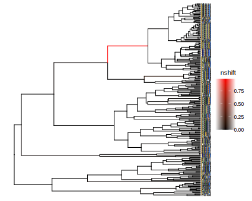

# Number of rate shifts

### Tree file

First, we load the necessary modules and read in the tree file.

```@setup shift
using Pesto
using Plots

ρ = 0.635

include("../../src/primates.jl")
```
```julia shift
using Pesto
using Plots

phy = readtree(Pesto.path("primates.tre"))
ρ = 0.635
primates = SSEdata(phy, ρ)
```

### Model setup

In this vignette, we pick the rate values by hand, and we don't use so many, in order to illustrate how the calculations work.

```@example shift
tree_length = sum(primates.branch_lengths)
λ = [0.1, 0.2, 0.3, 0.4, 0.20]
μ = [0.05, 0.15, 0.05, 0.15, 0.25]
η = 1 / tree_length
model = SSEconstant(λ, μ, η)
nothing # hide
```

## Branch densities

In order to calculate the number of state shifts, we must first calculate the branch probability densities conditional on the tips (postorder tree iteration):

```math
\frac{dD_{M,i}}{dt} = - (\lambda_i + \mu_i + \eta) D_{M,i} + 2 \lambda_i D_{M,i} E_i + \frac{\eta}{K-1} \sum_{j \neq i}^K D_{M,j}
```

We also calculate the branch densities conditional on the ancestral states (preorder iteration):

```math
\frac{dF_{M,i}}{dt} = (\lambda_i + \mu_i + \eta) F_{M,i} - 2 \lambda_i F_{M,i} E_i - \frac{\eta}{K-1} \sum_{j \neq i}^K F_{M,j}
```

where `M` is the branch index, and `i` is the state index. In code, this is done as follows:
```@example shift
Ds, Fs = backwards_forwards_pass(model, primates);
nothing # hide
```
`Ds` and `Fs` are Dictionaries indexed over the branch indices (from 1 up to 2n-2). For example, branch `i=2` has the numerical solution `Ds[2]`. If you are curious, we can plot the solution of `D(t)` for branch `i=2` as follows:
```@example shift
using Plots
plot(Ds[2], xflip = true, grid = false, legend = :topleft, 
     size = (500, 300), xlabel = "time (Ma)", ylab = "D(t)")
```

## Ancestral state probabilities
In order to get the ancestral state probabilities, we need to compute
```math
S_{M,i}(t) = \frac{F_{M,i}(t) D_{M,i}(t)}{\sum\limits_{j=1}\limits^K F_{M,j}(t) D_{M,j}(t)}
```
which can be done using the following code:
```@example shift
Ss = ancestral_state_probabilities(primates, Ds, Fs)
nothing # hide
```
## Number of rate shifts
The number of rate shifts from state `j` to state `i` accumulated over the branch length (from old to young) is described by the following differential equation
```math
\frac{d\hat{N}_{M,ij}}{dt} = S_{M,j}(t) \frac{-\eta}{K-1} \frac{D_{M,i}(t)}{D_{M,j}(t)} \text{ if } j \neq i
```
with initial condition $\hat{N}_{ij}(t_0) = 0$. In Pesto, we would compute this using
```@example shift
nshift = state_shifts(model, primates, Ds, Ss; ape_order = false)
nothing; # hide
```
The object returned `nshift` is a three-dimensional array. The first dimension corresponds to the branch index (what was `M`). The second dimension represents the arrival state (`i`), and the third dimension represents the departure state (`j`). If `ape_order = false`, then the first dimension is reordered such that the indices correspond to the node indices in the tree.

If we sum over second and third dimension, we get the number of rate shifts per branch:
```@example shift
sum(nshift, dims = 2:3)[:,1,1]
``` 

If instead we sum over the first dimension, we get a breakdown over which rate transitions were more frequent:
```@example shift
Nmatrix = sum(nshift, dims = 1)[1,:,:]
``` 
In this case, the most frequent rate shift was from state `2` to state `4`, with $\hat{N} = 0.95$ number of rate shifts. Going from state `2` to state `4` under this model means an increase of $0.4-0.2=0.2$ in speciation rate units. This can for example be visualized using a histogram:
```@example shift
mids, bins = makebins(Nmatrix, model, -0.35, 0.35; nbins = 7)
bar(mids, bins[:,1], xticks = (mids, round.(mids; digits = 2)), 
    xrotation = 90, label = "", grid = false,
    xlabel = "Change in speciation rate (λi - λj)", ylabel = "Number of rate shifts",
    size = (500, 300))
```
Most of the rate shift events represent a shift from a smaller to a larger speciation rate (i.e. $\lambda_i - \lambda_j > 0$), however some rate shifts are in the other direction ($\lambda_i - \lambda_j < 0$). There are also a few rate shift events where the speciation rate does not change ($\lambda_i - \lambda_j = 0$). In these events, it is the extinction rate that changes, and not the speciation rate.

## Tree plots
If we want to plot the results, we can use the module `RCall`. Julia objects can be exported to an R session using the macro `@rput`, (and retrieved from R with `@rget`). R code can be called by prefixing a string with `R`, e.g. `R"print()"`, or multiline `R"""..."""`. You can also enter the R session interactively through the Julia REPL by entering the character `$`. Here we plot the phylogeny using some R-packages that we load first.

```julia
using RCall

N = state_shifts(model, primates, Ds, Ss; ape_order = true)
N = sum(N, dims = 2:3)[:,1,1]
@rput primates
@rput N

R"""
library(tibble)
library(tidytree)
x <- as_tibble(primates)
rates <- data.frame("node" = 1:465, "nshift" = N)
td <- as.treedata(merge(x, rates, by = "node"))
"""
```

We can use ggtree to plot the number of accumulated shifts on the branches
```julia
R"""
library(ggplot2)
library(ggtree)
p3 <- ggtree(td, aes(color = nshift)) + 
    geom_tiplab(size=2) +
    scale_colour_gradient(low = "black", high = "red")
"""
```

```R
ggsave("src/asses/primates_4state_shift.svg", p3, width = 150, height = 120, units = "mm") # hide
```
