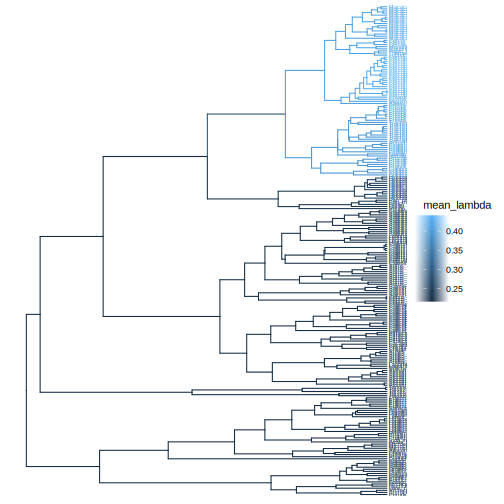

# Simple analysis

Here is an example of an analysis of branch-specific rates under the birth-death-shift model.

## Tree file

First, we load the necessary modules and read in the tree file.

```@setup simple
using Pesto

ρ = 0.635

include("../../src/primates.jl")
```
```julia simple
using Pesto

phy = readtree(Pesto.path("primates.tre"))
ρ = 0.635
primates = SSEdata(phy, ρ)
```

## Analysis
A simple analysis can be done like so:
```@example simple
model, rates = pesto(primates)
nothing # hide
```
To see how this analysis is set up, see the next section (Extended analysis).

## Tree plots
If we want to plot the results, we can use the module `RCall`. Julia objects can be exported to an R session using the macro `@rput`, (and retrieved from R with `@rget`). R code can be called by prefixing a string with `R`, e.g. `R"print()"`, or multiline `R"""..."""`. You can also enter the R session interactively through the Julia REPL by entering the character `$`. Here we plot the phylogeny using some R-packages that we load first.

```julia
using RCall

@rput primates
@rput rates

R"""
library(tibble)
library(tidytree)
x <- as_tibble(primates)
td <- as.treedata(merge(x, rates, by = "node"))
"""
```

We can plot the mean speciation rate

```julia
R"""
library(ggtree)
p1 <- ggtree(td, aes(color = mean_lambda)) +  
    geom_tiplab(size=2)
"""
```
