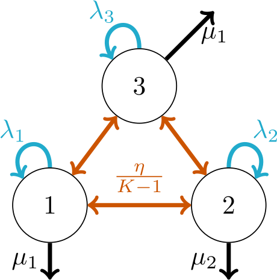

## Background

Pesto is an acronym for "Phylogenetic Estimation of Shifts in the Tempo of Origination". 
Broadly speaking, it is a method for detecting shifts in the process of diversification that led to the biodiversity present today.
In order to study diversification, we are interested in two events: speciation and extinction events. 
Since these events are difficult to observe, we use a simple model, the birth-death process, to model what happened in the past. 
On this page, there is some background material that introduces the mathematical models that we use.

## The birth-death model

Under the standard birth-death model, the tempo at which species speciate and go extinct are controlled by two parameters (Nee et al. 1994):
* The speciation rate ($\lambda$)
* The extinction rate ($\mu$)
In its simplest model, the rates of the birth-death process are the same across different lineages in the tree, and across time.
By simulating under the birth-death process, and pruning the extinct lineages from the tree, one gets a **reconstructed phylogenetic tree** as a result (i.e. it is ultrametric, all tips end at the same time point).

## The birth-death-shift model
 
The question we are interested in, is whether the process of diversification changed throughout the phylogenetic tree.
In other words, was there a shift or not, and if so, how large was the shift?
To do so, we are employing a variant of the state-dependent birth-death model (first presented by Maddison et al. 2007).
This is also called the birth-death-shift model, or the lineage-specific birth-death model (Höhna et al. 2019).
The birth-death-shift model has three parameters that control how the branching process behaves:
* The state-dependent speciation rate ($\lambda_i$)
* The state-dependent extinction rate ($\mu_i$)
* The common shift rate ($\eta$). 

```@raw html
<center></center>
```

When a shift event occurs, the speciation and extinction rate shifts from the previous state (say $\lambda_1,\mu_1$) to a new state with different rates ($\lambda_2,\mu_2$). 
A rate shift to any other rate category occurs with rate $\eta$, and a rate shift from state $i$ to a specific other state $j$ occurs with rate $\eta/(K-1)$. 
The figure above depicts a three-state model. However, depending on how the model is set up, there can by any $K$ number of states. 

## Probability of observing the tree 

The probability of observing the reconstructed phylogeny is the calculated similarly to that of the binary-state speciation and extinction model (BiSSE, Maddison et al. 2007), and the multi-state speciation and extinction model (MuSSE, FitzJohn 2012). 
We first calculate the probability of going extinct before the present, if a lineage was alive at some age `t` in the past:
```math
 \frac{dE_{i}(t)}{dt} = \mu_i - (\lambda_i + \mu_i + \eta) E_{i}(t) + \lambda_i E_{i}(t)^2 + \frac{\eta}{K-1} \sum_{j \neq i}^K E_{j}(t).
```
The initial state for $E_i(t)$ is equal to $1-\rho$ for all states, where $\rho$ is the taxon sampling fraction (we assume uniform taxon sampling probability).
Next, we calculate the probability of observing the subtree descended from branch `M` at time `t`, given that the the process began in rate category `i`:
```math
\frac{dD_{M,i}(t)}{dt} = - (\lambda_i + \mu_i + \eta) D_{M,i}(t) + 2 \lambda_i D_{M,i}(t) E_i(t) + \frac{\eta}{K-1} \sum_{j \neq i}^K D_{M,j}(t).
```
We solve $D_{M,i}(t)$ for each branch `M` and each state `i`, in a postorder tree traversal.
 At the tips, the initial state is $D_{M,i}(t)=\rho$ for all states. 
 At the branching events, the initial state for the ancestor branch `A` is assigned $D_{A,i}(t) := D_{L,i}(t) \times D_{R,i}(t) \times \lambda_i$ where `L` and `R` are the left and right descendant branches. 
 Continuing this toward the root of the tree, we calculate the probability as follows:
```math
P(\Psi|Z_A = i,\boldsymbol{\lambda},\boldsymbol{\mu},\eta,\rho) = D_{A,i}(t),
```
where $\Psi$ represents the reconstructed phylogeny, $t$ is the age of the most recent common ancestor, $Z_A$ is the random variable representing the diversification rate category that was active at the ancestral node, and $\boldsymbol{\lambda},\boldsymbol{\mu}$ represent the diversification rate categories.
At first, we are not interested in inferring the ancestral rate category $Z_A$.
Therefore, we integrate out $Z_A$ using the prior probability $P(Z_A)$.
We would also like to impose two conditions, in order to correct for ascertainment bias in empirical phylogenies. Thus, the probability becomes
```math
P(\Psi|\boldsymbol{\lambda},\boldsymbol{\mu},\eta,\rho) = \sum_{i=1}^K \Big [ P(Z_A = i) \frac{D_{A,i}(t) }{(1 - E_i(t))^2 \times \lambda_i} \Big ].
```
Dividing by $(1- E_i(t))^2$ entails that we are conditioning on that both the left and the right subtrees descended from the root node survived until the present. 
Similarly, dividing by $\lambda_i$ means that we condition on that there was a speciation event at the root node of the phylogeny.
This probability equation serves as our likelihood function when we infer the shift rate (in the two-step approach) 
```math
L(\eta|\Psi) = P(\Psi|\boldsymbol{\lambda},\boldsymbol{\mu},\eta,\rho),
```
or when we infer the shift rate and the base distribution simultaneously (joint approach)
```math
L(\hat{\lambda},\hat{\mu},\eta|\Psi) = P(\Psi|\boldsymbol{\lambda},\boldsymbol{\mu},\eta,\rho),
```
where $\hat{\lambda},\hat{\mu}$ are parameters that control the scale of the base distributions, which in turn determines the discrete rate categories $\boldsymbol{\lambda},\boldsymbol{\mu}$.

## References

* Nee, S., May, R. M., & Harvey, P. H. (1994). The reconstructed evolutionary process. Philosophical Transactions of the Royal Society of London. Series B: Biological Sciences, 344(1309), 305-311.
* Maddison, W. P., Midford, P. E., & Otto, S. P. (2007). Estimating a binary character's effect on speciation and extinction. Systematic biology, 56(5), 701-710.
* FitzJohn, R. G. (2012). Diversitree: comparative phylogenetic analyses of diversification in R. Methods in Ecology and Evolution, 3(6), 1084-1092.
* Höhna, S., Freyman, W. A., Nolen, Z., Huelsenbeck, J. P., May, M. R., & Moore, B. R. (2019). A Bayesian approach for estimating branch-specific speciation and extinction rates. BioRxiv, 555805.
